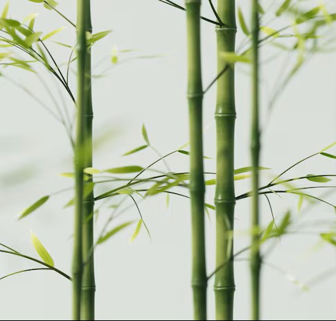
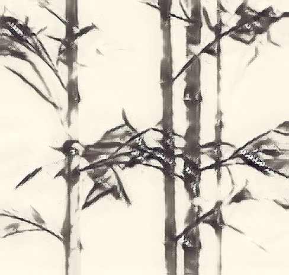
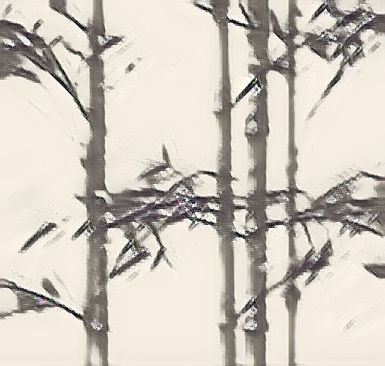
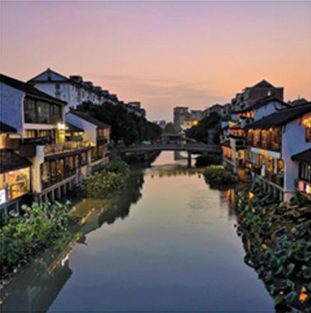
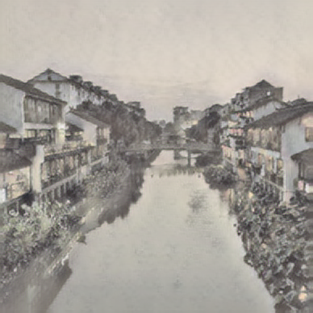
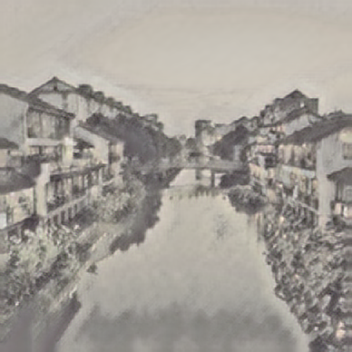

# Traditional Chinese Paintings Stylization
## Introduction
Traditional Chinese painting (水墨畫) relies on expressive brush strokes, controlled ink diffusion, and large meaningful blank regions to convey mood and spirit rather than realistic detail. There is interest in applying style transfer to recreate this aesthetic from ordinary photographs. However, most style-transfer methods are developed for texture-rich Western paintings and assume dense, uniformly distributed style patterns. This mismatch causes over-texturing, and unwanted strokes in areas that should remain empty, ultimately breaking the semantic structure and losing the subtle expressive quality of ink art.

## Approaches

- Blank Areas Are Incorrectly Filled With Texture  
  - Content-Aware Weighting (White-space Mask)  
  - Reduces style loss weight in blank zones.

- Model ignores brush features.  
  - Multi-scale Style Loss (Laplacian Pyramid)  
  - Produces natural gradations of ink density.

## Laplacian Pyramid loss

<div align="center">
    
    <p>bamboo content image</p>
    
    <p>With Laplacian Pyramid loss</p>
    
    <p>johnson model</p>
</div>

## White-space Mask

<div align="center">
    
    <p>content image</p>
    
    <p>With White-space Mask</p>
    
    <p>johnson model</p>
</div>

## Setting This Up On Your Computer
This project is very easy to set up — all required dependencies can be installed in just a few steps.  
The code has been tested with **Python 3.11**

## How To Style Your Image Or Video
You'll have to first navigate to the project file in your terminal.
### Stylize Your Image
To style your own image, here is the most basic command you can write:
```
python my_inference.py --image_path {PATH TO YOUR VIDEO} --pretrained_model {ONE OF MY PRETRAINED MODELS}
```
For example, to generate bahla's fort in the style of the starry night, you have to type the following command:
```
python my_inference.py --image_path images/content_images/bahla-fort.jpg --pretrained_model starry_night
```

For more options, here's what the help message gives:
```
usage: Stylize an image [-h] --image_path IMAGE_PATH [--image_size IMAGE_SIZE] [--pretrained_model {starry_night,rain_princess,abstract,mosaic}]
                        [--model_path MODEL_PATH] [--save_path SAVE_PATH]

optional arguments:
  -h, --help            show this help message and exit
  --image_path IMAGE_PATH
                        path to the image to be stylized
  --image_size IMAGE_SIZE
                        size of the image to be stylized. if not specified, the image will not be resized
  --pretrained_model {starry_night,rain_princess,abstract,mosaic}
                        pretrained model to be used for stylizing the image
  --model_path MODEL_PATH
                        path to the model to be used for stylizing the image
  --save_path SAVE_PATH
                        path to save the stylized image
```
Note that either a pretrained model or a model path need to be specified.

## How To Train Your Own Model

I've also provided an interface for you to train your own model from scratch. Note that this is very computationally heavy, and unless you have a good GPU and good RAM (12+ GB), be ready for your computer to be taken hostage by the training process.

You'll have to download a large image dataset on your computer to train on. The original paper used the 2014 [MS-COCO test dataset](https://cocodataset.org/#download) (80k images) and trained on it for two epochs. Because all I have is an M1 macbook air, I only trained my models for one epoch, but the results *mostly* converged.

Here is the most simple command to train a model:
```
python my_train.py --style_image_path {PATH TO YOUR STYLE IMAGE} --train_dataset_path {PATH TO DATASET}
```
For example, to train a model on the 2014 ms-coco datset to transform an image to the style of the starry night, you have to type the following command:
```
python my_train.py --style_image_path images/style_images/starry-night.jpg --train_dataset_path data/mscoco
```

You can also monitor the training of your model through tensorboard by typing the following in your terminal:

```
tensorboard --logdir=runs --samples_per_plugin images={MAX IMAGES}
```
<!-- TODO: add tensorboard demo -->
Note you'll need multiple terminals for this: one for training your model and one for the tensorboard. I used the terminals provided in VSCODE for the training and my default terminal for tensorboard. 

For more options, here is what the help message gives:
```
usage: Train a model [-h] --style_image_path STYLE_IMAGE_PATH [--train_dataset_path TRAIN_DATASET_PATH] [--save_path SAVE_PATH] [--epochs EPOCHS]
                     [--batch_size BATCH_SIZE] [--image_size IMAGE_SIZE] [--style_size STYLE_SIZE] [--style_weight STYLE_WEIGHT] [--content_weight CONTENT_WEIGHT]
                     [--tv_weight TV_WEIGHT] [--learning_rate LEARNING_RATE] [--checkpoint_path CHECKPOINT_PATH] [--checkpoint_interval CHECKPOINT_INTERVAL]
                     [--device {cpu,cuda,mps}]

optional arguments:
  -h, --help            show this help message and exit
  --style_image_path STYLE_IMAGE_PATH
                        path to the style image
  --train_dataset_path TRAIN_DATASET_PATH
                        path to the training dataset
  --save_path SAVE_PATH
                        path to save the trained model
  --epochs EPOCHS       number of epochs to train the model for
  --batch_size BATCH_SIZE
                        batch size to train the model with
  --image_size IMAGE_SIZE
                        image size to train the model with
  --style_size STYLE_SIZE
                        style size to train the model with. if not specified, the orignal size will be used
  --style_weight STYLE_WEIGHT
                        weight of the style loss
  --content_weight CONTENT_WEIGHT
                        weight of the content loss
  --tv_weight TV_WEIGHT
                        weight of the total variation loss
  --learning_rate LEARNING_RATE
                        learning rate to train the model with
  --checkpoint_path CHECKPOINT_PATH
                        path to the checkpoint to resume training from. If not specified, training will start from scratch
  --checkpoint_interval CHECKPOINT_INTERVAL
                        number of images to train on before saving a checkpoint. keep it a multiple of the batch size
  --device {cpu,cuda,mps}
                        device to train the model on
```

This project is adapted from the original work at:  
https://github.com/igreat/fast-style-transfer?tab=readme-ov-file
All credits go to the original authors. This repository includes modifications and improvements tailored for my use case.
